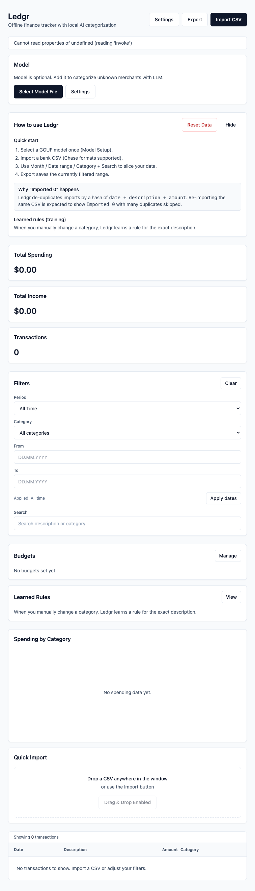
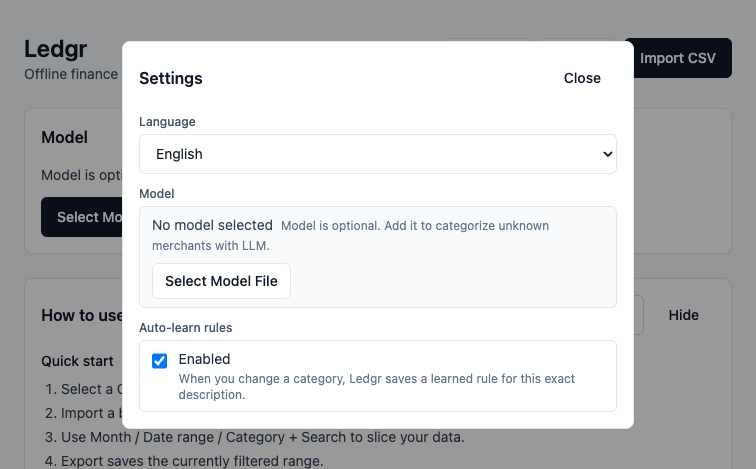
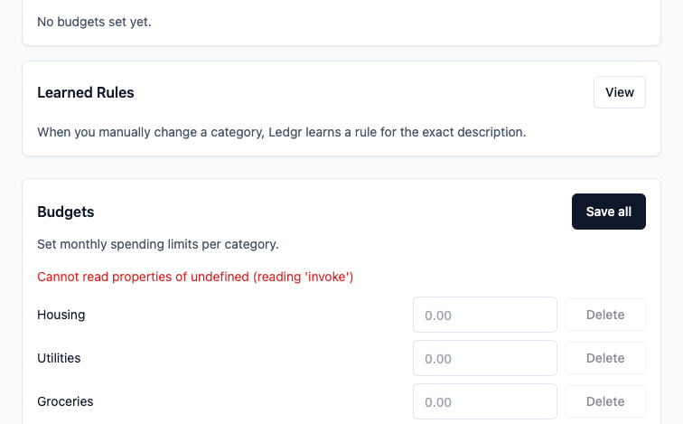

# Ledgr

Offline desktop finance tracker for macOS with local AI categorization.



## Features

- **CSV Import** — Chase 3-column and 7-column formats; drag-and-drop or file picker
- **AI Categorization** — local llama.cpp inference (GGUF models), no cloud calls
- **Learned Rules** — manually re-categorize once, Ledgr remembers the pattern
- **Budget Tracking** — set monthly limits per category with progress bars
- **Dashboard** — spending charts, filters by date/category/search
- **Export** — filtered transactions to CSV
- **Multi-language** — English and Russian





## Quick Start

### Prerequisites

- macOS (Apple Silicon)
- [Rust](https://rustup.rs/) (stable)
- [Node.js](https://nodejs.org/) LTS
- [pnpm](https://pnpm.io/) 9+

### Build & Run

```bash
git clone https://github.com/humanji7/ledgr.git
cd ledgr
pnpm install
pnpm tauri:dev
```

### Build DMG

```bash
pnpm tauri:build
# Output: src-tauri/target/release/bundle/dmg/Ledgr_*.dmg
```

### Run Tests

```bash
pnpm test              # frontend (Vitest)
cd src-tauri && cargo test  # backend (Rust)
```

## Privacy

Ledgr makes **zero network calls**. All data stays in a local SQLite database. AI inference runs entirely on-device via llama.cpp.

Verify yourself:

```bash
# While Ledgr is running
lsof -i -P | grep -i ledgr
# Expected: no output (no open network connections)
```

## Limitations

- **Chase CSV only** — other bank formats are not yet supported
- **macOS ARM only** — no Windows/Linux builds
- **Not code-signed** — macOS Gatekeeper will warn on first launch; right-click → Open to bypass
- **Model not included** — download a GGUF model separately (e.g. Qwen2.5 1.5B Instruct)

## Tech Stack

| Layer    | Technology                        |
|----------|-----------------------------------|
| Shell    | Tauri 2.0 (Rust)                  |
| Frontend | React 18, TypeScript, Tailwind CSS |
| Storage  | SQLite (rusqlite, bundled)        |
| AI       | llama.cpp (sidecar binary)        |
| Charts   | Recharts                          |

## Contributing

See [CONTRIBUTING.md](CONTRIBUTING.md).

## License

[MIT](LICENSE)
